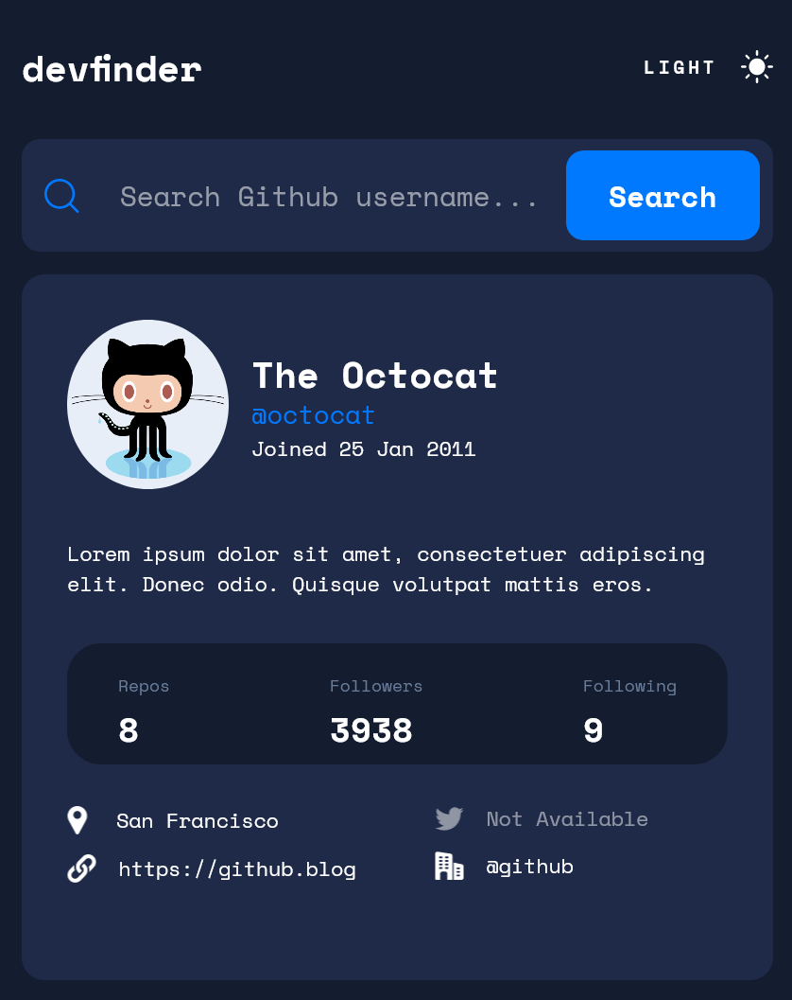
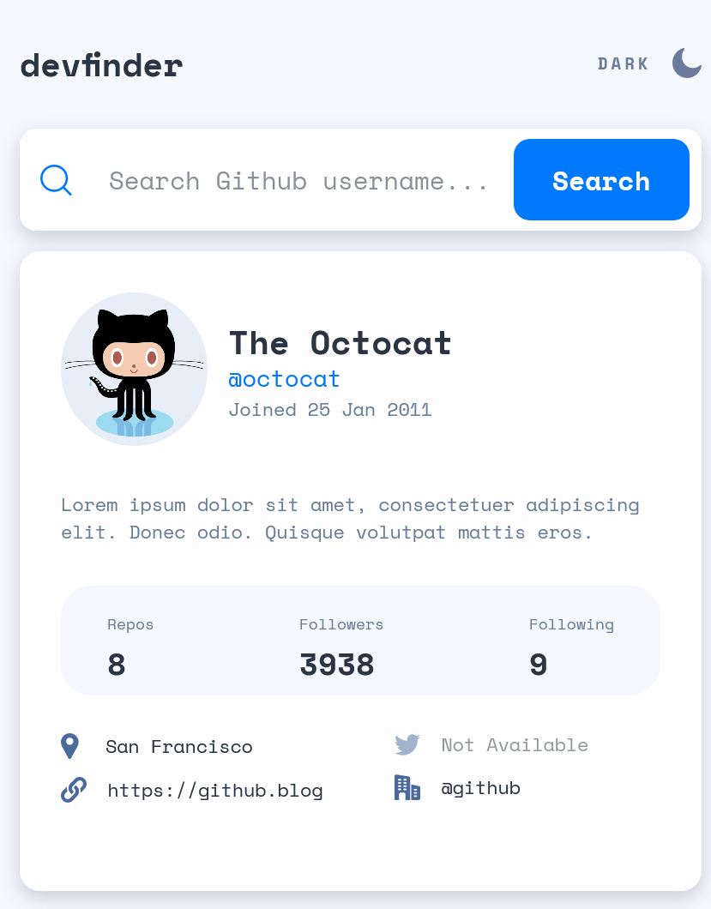
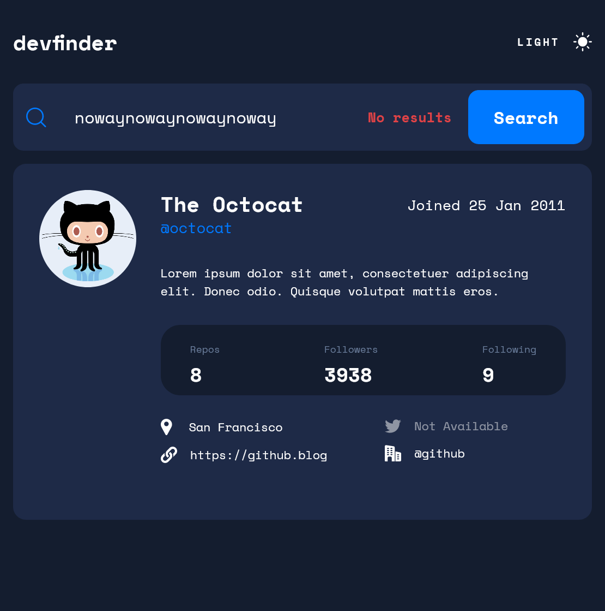
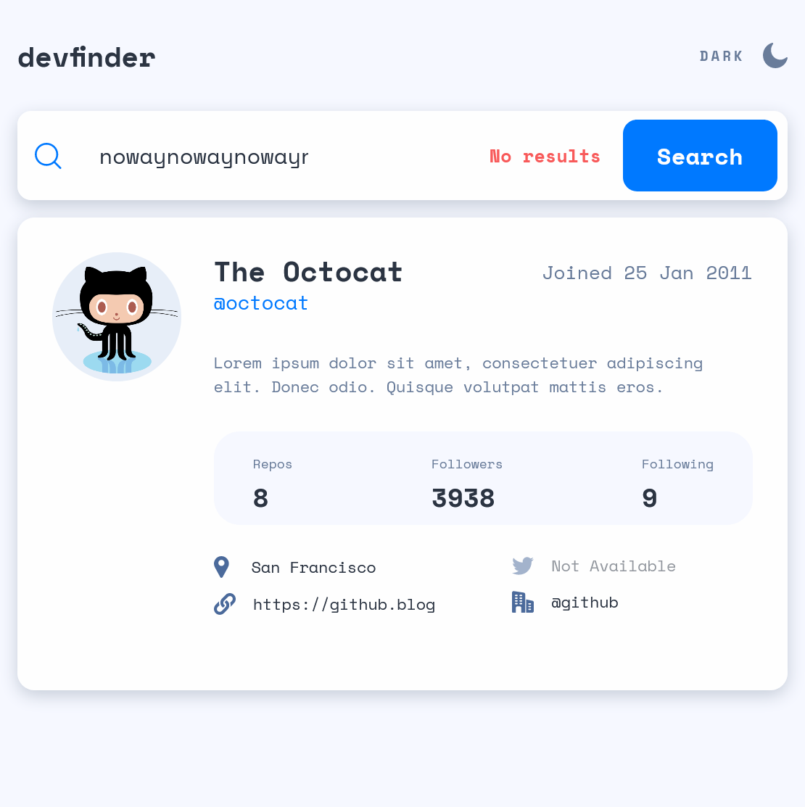
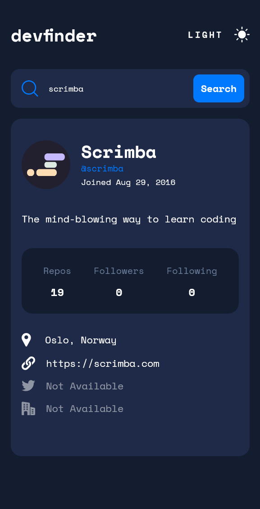
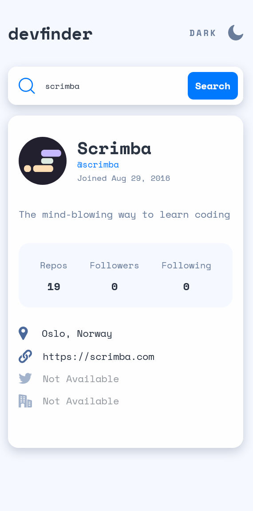

# Frontend Mentor - GitHub user search app solution

This is a solution to the [GitHub user search app challenge on Frontend Mentor](https://nottohave.github.io/frontendmentor_octocat/). 

## Table of contents

- [Overview](#overview)
  - [The challenge](#the-challenge)
  - [Screenshot](#screenshot)
  - [Links](#links)
- [My process](#my-process)
  - [Built with](#built-with)
  - [What I learned](#what-i-learned)
  - [Continued development](#continued-development)
  - [Useful resources](#useful-resources)
- [Author](#author)
- [Acknowledgments](#acknowledgments)

## Overview

### The challenge

Users should be able to:

- View the optimal layout for the app depending on their device's screen size
- See hover states for all interactive elements on the page
- Search for GitHub users by their username
- See relevant user information based on their search
- Switch between light and dark themes
- **Bonus**: Have the correct color scheme chosen for them based on their computer preferences. _Hint_: Research `prefers-color-scheme` in CSS.

### Screenshot









### Links

- Solution URL: [Frontendmentor solution](https://www.frontendmentor.io/solutions/github-user-search-app-html-css-js-api-o0MttH_2J)
- Live Site URL: [Octocat Frontendmentor Challenge](https://nottohave.github.io/frontendmentor_octocat/)

## My process

### Built with

- Semantic HTML5 markup
- CSS custom properties
- Flexbox
- CSS Grid
- Mobile-first workflow

### What I learned
Utilize Javascript DOM elements, prefer color scheme, a little bit of grid and flex box, javascript promise, a little bit of CSS BEM convention 

To see how you can add code snippets, see below:

```html
        <div class="form-group">
            
            <input type="text" class="form-control" id="search" placeholder="Search Github username..." required>
            <label for="search-status-of-user" class="search-status-label">No results</label>
            <button class="form-group__searchBtn">
                Search
            </button>
```
```css
@media (prefers-color-scheme: dark) {
    body {
        background-color: #141D2F;
    }
}
```
```js
form.addEventListener("submit", function(e){
    e.preventDefault();

    var search = document.getElementById("search").value;
    var originalName = search.split(" ").join("");

    fetch("https://api.github.com/users/" + originalName)
    .then((result) => result.json())
    .then((data) => {
      console.log("Cheese!);
      console.log(data);
     }
```

### Continued development

- See hover states for all interactive elements on the page - Darkmode search button hover state need to be worked on. Right now it is darken the button when user hover their mouse over.
- **Bonus**: Have the correct color scheme chosen for them based on their computer preferences. _Hint_: Research `prefers-color-scheme` in CSS.  --- The website color scheme can change following user computer preferences, however, when they are in dark mode, dark and light mode button won't carry out the effect. 


### Useful resources

- [Dark mode with a media query!](https://youtu.be/_yCgeXFAXTM) - Tutorial for `prefers-color-scheme`
- [MDN source](https://developer.mozilla.org/en-US/) - Amazing source to get the explaination and examples to practice and apply on your code
- [W3 School](https://www.w3schools.com/) - You can find short explaination on Javascript Dom Object here. 

## Author

- Github - [nottohave](https://github.com/nottohave)
- Frontend Mentor - [@nottohave](https://www.frontendmentor.io/profile/nottohave)

## Acknowledgments

Thank you for Frontendmentor creating this challenge. 
